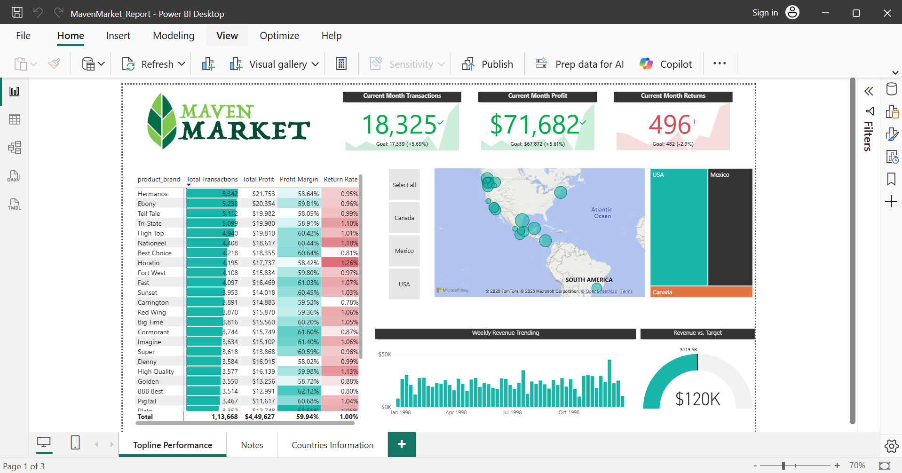
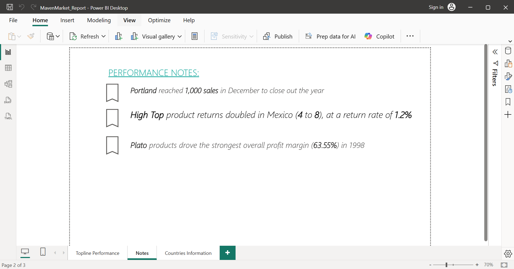
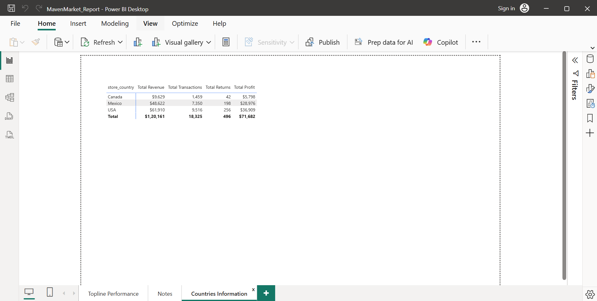

# retail-performance-analytics

## Executive Summary
This project delivers an **end-to-end analytical reporting solution** for a multi-country retail organization (Maven Market), designed using **enterprise data modeling principles** and **production-grade Power BI practices**.

The dashboard enables leadership to monitor **revenue, profitability, transaction volume, and return behavior** across regions, products, and time, while ensuring **model scalability, performance, and analytical correctness**.

## What’s inside
- Power BI report: `pbix/MavenMarket_Report.pbix`
- Dashboard screenshots: `images/`

## Data model

## Dashboard

## Core KPIs & Metrics
The following enterprise KPIs were implemented using **DAX best practices**:

- **Total Revenue**
- **Total Profit**
- **Total Transactions**
- **Profit Margin (%)**
- **Return Rate (%)**
- **Current Month vs Target**
- **Year-over-Year comparisons**
- **Weekend vs Weekday Transactions**

Measures are centralized in a **dedicated Measure Table** to improve maintainability.

## Technology Stack
- **Power BI Desktop**
- **DAX**
- **Power Query (M)**
- **Dimensional Data Modeling**
- **GitHub (Version Control & Documentation)**

## How to Use This Project
1. Download the `.pbix` file from the `/pbix` folder
2. Open in Power BI Desktop
3. Review model relationships and measures
4. Interact with dashboard visuals

## Portfolio Context
This project demonstrates:
- Enterprise-grade data modeling
- KPI-driven dashboard design
- Analytical storytelling
- Performance-aware Power BI development

It reflects the type of reporting solutions delivered in **financial services, retail analytics, and enterprise BI teams**.

## Author
**Harika Murari**  
Data Engineer / BI Engineer  
Power BI • SQL • Data Modeling • Analytics Engineering
